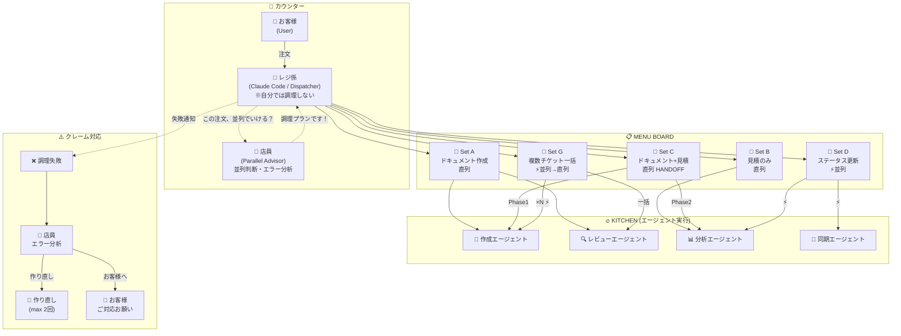

## Claude Codeで10以上の専門エージェントを運用する中で、**「誰が何を判断するか」が最大のボトルネック**になった。解決策は意外にも「ハンバーガーショップのオペレーション」をメタファーにした設計パターンだった。

---

## 🍔 はじめに：エージェントが増えると何が起きるか

Claude Codeの`Task`ツールでサブエージェントを使い始めると、最初は快適だ。1つのエージェントに1つのタスクを投げて、結果を受け取る。シンプル。

しかしエージェントが5, 8, 10と増えていくと、こんな問題が出てくる：

- **どのエージェントに投げるべきか**の判断に時間がかかる
- 複数のエージェントを**直列で呼ぶのか、並列でいけるのか**がわからない
- エージェントが失敗したとき、**リトライすべきかユーザーに聞くべきか**の判断が曖昧
- 結果として**Claude Code自身がボトルネック**になる

これ、ハンバーガーショップで言えば「レジ係がキッチンの調理順序まで全部考えてる」状態だ。

---

## 🏗️ アーキテクチャ：3つの役割を分離する

解決策として、以下の3つの役割を明確に分離した。

### 全体構成図



### 役割分離

| 役割 | 担当 | やること | やらないこと |
|------|------|----------|------------|
| 🍔 **店員** (Advisor) | 専用エージェント | 並列判断、依存関係分析、エラー分析 | タスク実行、結果収集 |
| 🤖 **レジ係** (Dispatcher) | Claude Code本体 | 注文受付、エージェント起動、結果報告 | 自分で調理（=タスク実行） |
| 🔥 **キッチン** (Workers) | 各専門エージェント | 担当タスクの実行 | 他エージェントとの調整 |

**ポイント：店員（Advisor）はタスクを実行しない。**

これが重要だ。店員をオーケストレーターにすると、全タスクが店員を経由する「ボトルネック」になる。

```
【❌ 店員がオーケストレーター（ボトルネック！）】
店員 → Task起動 → 待機 → Task起動 → 待機 → ...

【✅ 店員はアドバイザーのみ】
レジ係 → 店員 "この注文、並列でいける？"
       → 店員: "いけます！調理プランです"
       → レジ係がTask×3を同時起動（店員はもう関与しない）
```

---

## 📋 セットメニュー：再現可能なワークフロー

ハンバーガーショップにはセットメニューがある。「ビッグマックセット」と言えば、バーガー + ポテト + ドリンクが出てくる。**毎回組み合わせを考えなくていい。**

これをClaude Codeに適用した。

### メニューボード

```
╔══════════════════════════════════════════════╗
│ 📋 MENU BOARD                                │
│                                              │
│ 🍔 Set A  ドキュメント作成     直列          │
│ 🍟 Set B  見積のみ             直列          │
│ 🥤 Set C  ドキュメント+見積    直列(HANDOFF)  │
│ 🍗 Set D  ステータス更新       ⚡ 並列       │
│ 🥗 Set G  複数チケット一括     ⚡ 並列→直列  │
╚══════════════════════════════════════════════╝
```

### 各セットの中身

**Set A（フルパイプライン）** - 直列調理
```
作成エージェント → レビューエージェント(内部) → Wiki公開
```
1つのチケットに対して、ドキュメント作成→品質レビュー→公開までを一気通貫で実行。

**Set C（HANDOFF パターン）** - 直列だが受け渡しに注意
```
作成エージェント(Phase1) → 🔗 HANDOFF → 分析エージェント(Phase2)
```
Phase1の出力ファイルのPATHだけをPhase2に渡す。**Claude Code（レジ係）はファイルの中身を読まない。** これがNon-Interventionポリシー。

**Set D（並列調理）**
```
分析エージェント ⚡ 同期エージェント  ← 異なるリソースなので並列OK
```

**Set G（複数チケット一括）**
```
作成エージェント① ⚡ 作成エージェント② ⚡ 作成エージェント③
                         ↓ 全員完了後
                  レビューエージェント（一括）
```

---

## ⚡ 並列判断：店員の仕事

店員（Advisor）が判断するのは、主に以下の3つ：

### 1. 依存関係の検出

```json
{
  "analysis": "3つの独立したドキュメント作成タスク",
  "parallelizable": true,
  "recommended_plan": {
    "parallel_tasks": ["ticket-A", "ticket-B", "ticket-C"],
    "sequential_tasks": [
      {"task": "review", "depends_on": ["ticket-A", "ticket-B", "ticket-C"]}
    ]
  }
}
```

### 2. リソース競合の検出

ここが意外と重要。**外部API（MCP）はblocking方式で直列のみ**という制約がある。

| リソース | 並列可否 | 理由 |
|----------|----------|------|
| ローカルファイル（別ディレクトリ） | ✅ | 競合なし |
| Wiki読み取り（異なるページ） | ⚠️ | API自体は直列だが、エージェント内で吸収 |
| Wiki書き込み | ❌ | バージョン競合リスク |
| 同じチケットへの操作 | ❌ | データ不整合リスク |

### 3. コンテキスト分離の保証

並列実行する各タスクが互いに干渉しないことを確認する：
- 出力パスが異なること
- 共有状態がないこと
- タスクIDで結果を追跡できること

---

## ⚠️ エラーリカバリー：クレーム対応

調理が失敗することもある。そのとき「店員」がエラーパターンを分析して対応を決める。

```
レジ係: 「調理失敗の通知が来ました」
  ↓
店員: エラーパターンを照合
  ↓
店員 → レジ係に回復戦略を返す
  ↓
レジ係が実行:
  🔄 作り直し → エージェント再起動（修正プロンプト付き、最大2回）
  👤 お客様へ → ユーザーに通知・待機
```

### エラーパターン辞書（抜粋）

| パターン | 原因 | 対応 |
|----------|------|------|
| 権限エラー | Plan Modeで起動 | リトライ（権限注記追加） |
| 認証切れ | OAuthトークン期限切れ | ユーザー対応 |
| タイムアウト | 並列MCP過多 | 直列に変更してリトライ |
| リソース不在 | ID/ページが存在しない | ユーザー確認 |

---

## 🔑 Non-Intervention ポリシー

このアーキテクチャで最も重要なルール：

> **レジ係（Claude Code）は調理しない。**

具体的には：
- ❌ エージェントの出力ファイルを読んで要約する
- ❌ エージェントの出力を整形・改善する
- ❌ エージェント完了後にMCPを直接叩く
- ✅ 出力パスをそのままユーザーに伝える（VERBATIM）
- ✅ 問題があれば「エージェント出力に問題がある可能性。再実行しますか？」と聞く

なぜか？Claude Codeが中間で処理すると：
1. **トークンを大量消費**する（大きなファイルを読むだけで数千トークン）
2. **情報が劣化**する（専門エージェントの構造化出力を崩す）
3. **責任の所在が曖昧**になる（誰が書いた内容なのか？）

---

## 🛠️ 実装のポイント

### Skill（スラッシュコマンド）で定義

各セットメニューはClaude Codeの`skill`として定義する。

```yaml
name: set-a
description: 🍔 Set A - ドキュメント作成フルパイプライン
allowed-tools: Task
---
Arguments: $ARGUMENTS

Use Task tool (subagent_type: creator-agent) with this prompt:
"Create document for {JIRA_ID} version {VERSION}. Run full pipeline..."

After Task completes:
- Report output paths to user VERBATIM
- Do NOT read any output files
```

### tmuxで並列実行を実現

Claude Codeの`run_in_background: true`オプションでバックグラウンド実行する。内部的にtmuxが使われる。

```
# 店員の助言に基づいてレジ係が並列起動
Task(creator-agent, ticket-1, background=true)  ──┐
Task(creator-agent, ticket-2, background=true)  ──┤  同時起動
Task(creator-agent, ticket-3, background=true)  ──┘
```

### 店員エージェントのプロンプト設計

店員には「実行させない」ことが重要。SKILL.mdに明記する：

```markdown
## Core Mission
Analyze tasks for parallelization opportunities and provide execution plans.

**Critical**: This agent is a THINKING assistant, NOT an orchestrator.
Does NOT execute tasks - Claude Code handles all task execution.
```

---

## 📊 効果

| 指標 | Before | After |
|------|--------|-------|
| 3チケット処理 | 直列で~15分 | 並列で~6分 |
| エラー時の判断 | 人間が都度判断 | パターン辞書で自動判断 |
| ワークフロー再現性 | 毎回プロンプトを書く | `/set-a TICKET-123 1.0.0` |
| Claude Codeのトークン消費 | 多い（中間読み込み） | 少ない（PATH受け渡しのみ） |

---

## まとめ

マルチエージェント設計で悩んだら、ハンバーガーショップを思い出してほしい。

1. **レジ係は調理しない** → Claude Code = Dispatcher only
2. **店員は助言だけ** → Advisor Agent ≠ Orchestrator
3. **セットメニューを作る** → 再現可能なSkill定義
4. **並列調理は厨房に任せる** → `run_in_background: true`
5. **クレーム対応マニュアルを用意** → Error Recovery Pattern Dictionary

「🍔 ご注文、並列調理で承りました！」