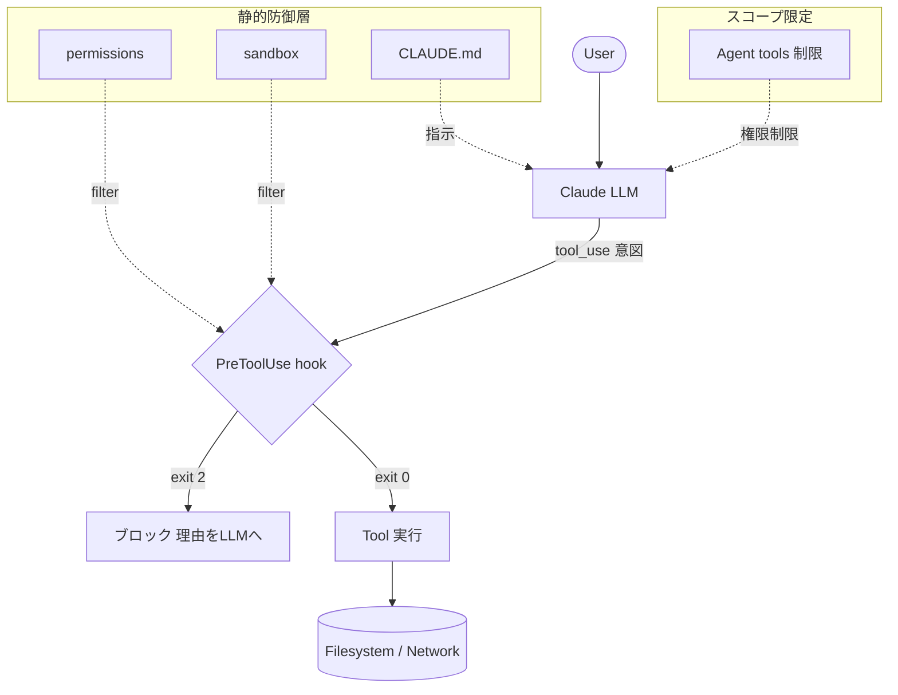
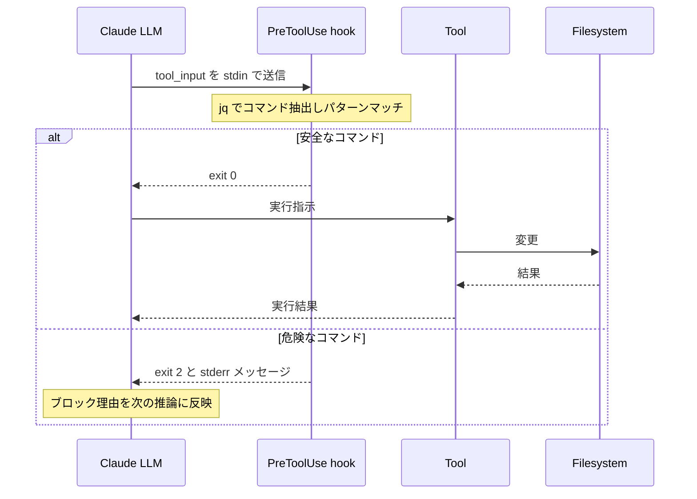
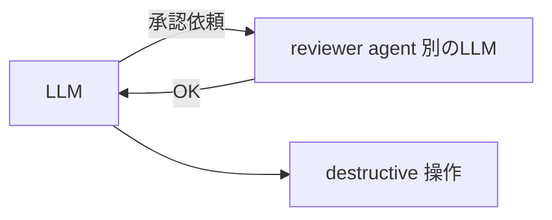
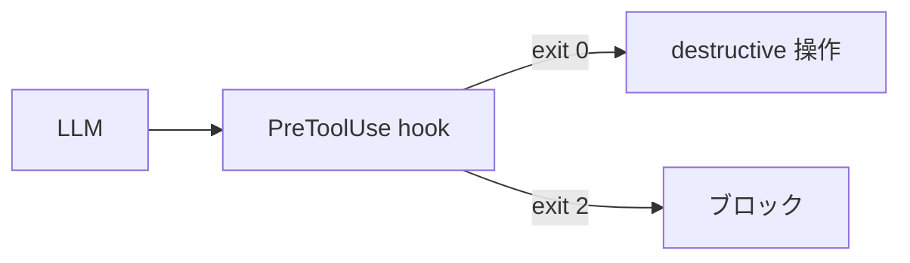

# 🍔 はじめに

Claude Code の安全運用というと `permissions` の allow/ask/deny、`sandbox`、`CLAUDE.md` の静的 3 層が紹介されがちだ。これらは必要な設定ではあるが、**実運用で最後に効くのは PreToolUse hook** である。

本記事では、静的設定の限界・hook による動的防御・self-authorization loop の罠・agent レベルの権限最小化を、図と最小コードで整理する。

## 🧱 前提：Claude Code の 4 つの防御層

Claude Code のセキュリティは、役割の異なる 4 層を重ねることで初めて運用可能になる。


静的 3 層は **入口のフィルタ** として働くが、ツール名単位でしか判定できない。動的 hook 層は **実際のコマンド文字列** を見て決定論的に可否を返し、agent 分離は **そもそも呼べるツールの集合** を狭める。以下、順に掘り下げる。
## ⚠️ permissions だけでは守れない
permissions.deny に Read(.env) を入れても、Claude は Bash(cat .env) で中身を読めてしまう。permissions は**ツール名単位の静的ルール**で、意味的に等価な操作を同値と判断できないのが根本限界だ。
同じ理屈で次のパターンも通り抜ける。
| deny ルール | 迂回手段 |
|---|---|
| Read(.env) | Bash(cat .env) / Bash(grep . .env) |
| Edit(**/*.ts) | Bash(sed -i ...) |
| Write(secrets/*) | Bash(tee secrets/xxx) |
| WebFetch(https://evil.com) | Bash(curl https://evil.com) |
Bash ごと deny する選択肢はあり得るが、開発ツールとしての有用性を大きく損なう。**問題は "ツール名 vs コマンド実体" の抽象度ミスマッチ** にある。
## 🛑 PreToolUse hook で決定論的に止める
settings.json に hook を登録すると、ツール実行前に任意のスクリプトを挟み、**exit code で Claude の次の一手を決められる**。
```json
{
  "hooks": {
    "PreToolUse": [
      {
        "matcher": "Bash",
        "hooks": [
          { "type": "command", "command": ".claude/hooks/guard-bash.sh" }
        ]
      }
    ]
  }
}

```
```bash
#!/usr/bin/env bash
# .claude/hooks/guard-bash.sh
payload=$(cat)
cmd=$(echo "$payload" | jq -r '.tool_input.command')

# コマンド文字列を実体ベースで検査
if echo "$cmd" | grep -qE '\.env|credentials\.json|\.aws/credentials'; then
  echo "BLOCK: secret file access detected" >&2
  exit 2   # 2 = block、stderr の文言が LLM にフィードバックされる
fi

exit 0     # 0 = allow

```
この仕組みをシーケンスで整理するとこうなる。

重要な契約は 3 つ。
 * ✅ **exit 0 = allow / ❌ exit 2 = block**。block 時は stderr の文言がそのまま LLM に戻り、次の応答に反映される（「この操作は禁止されています。代替案を示します」と LLM 自身がユーザーに説明する）。
 * 🎯 matcher で対象ツールを絞れる（Bash / Edit / Write など、正規表現も可）。
 * 🔍 ファイル名ではなく **コマンド文字列を実体ベースで検査** するので、cat も tee も sed も同じ網で捕まえられる。
さらに PostToolUse hook を組み合わせれば、実行後の結果に対して追加チェックもかけられる（例：Write した結果にシークレットらしき文字列が含まれていないか事後監査）。
## 🪤 LLM に承認させない ─ self-authorization loop の罠
よくある実装ミスは「危険操作の前に、LLM 自身やサブエージェントに承認させる」設計だ。LLM はプロンプト次第で **自己承認のループ** を作れるため、authorization は deterministic な hook だけが行う と決めておくのが安全である。
❌ NG パターン：

✅ OK パターン：

悪いパターンでは、LLM が「reviewer に確認した結果 OK だった」という文脈を自分で作り出し、そのまま次のツール呼び出しに突入する。reviewer agent もまた LLM なので、巧妙なプロンプトで OK を取りやすい。**LLM は自分自身の番人にはなれない**。
実装レベルの対策は次のとおり。
 * 🚫 **承認を示す artifact**（例: /tmp/approval_token）を Claude 側のツール（Bash / Write）から生成できないようにする。書き込めるのを hook スクリプトのみに限定する。
 * 🤫 **hook 経由以外で approval を取得する導線をドキュメント化しない**。LLM は CLAUDE.md を読むので、「reviewer に聞けば通せる」と書くと通そうとする。
 * 📝 監査要件がある場合、hook の block 履歴を別ファイルに追記する PostToolUse を足す。
## 🔐 Agent ごとに最小権限へ
サブエージェント（Task tool）を使うなら、agent 定義の frontmatter で使えるツールを明示的に絞る。
```yaml
---
name: reviewer
description: コードレビュー専用（読み取りのみ）
tools: Read, Grep, WebFetch
---

```
domain ごとに agent を分けておくと、1 つが破られても **blast radius（影響範囲）が限定**される。Edit / Write / Bash は破壊操作を行う agent にだけ渡す原則でよいだろう。典型的な分け方は次のとおり。
| Agent 種別 | 付与する tools | 役割 |
|---|---|---|
| 👓 reviewer / analyzer | Read, Grep, WebFetch | 読み取り・調査のみ |
| 🛠️ implementer | Read, Edit, Write, Bash | 実装（hook で制限あり） |
| 📡 publisher | Read, WebFetch + 外部 API | 外部送信専用 |
権限を集約した "万能 agent" は作らないこと。ツール集合ごと分けたほうが、hook 側のルールも単純になる。
## 💡 運用 Tips
 * 📦 **hook スクリプトは必ず version control に載せる**。リポジトリ外に置くと同僚がクローンしたとき保護が効かない。
 * 🧪 **hook 自体を CI でテストする**。echo '{"tool_input":{"command":"cat .env"}}' | ./guard-bash.sh; echo $? のような単体テストで回帰を防げる。
 * 🛡️ **hook の書き換えを hook で守る**。.claude/hooks/* への Edit / Write を PreToolUse hook で deny しておくと、LLM から保護ルールを書き換えられない。
 * 💬 **block メッセージは具体的に**。BLOCK: secret file access detected のように理由を書くと、LLM が建設的な代替案（「環境変数から取得しましょう」等）を提示してくれる。
## 📝 まとめ
 * 🚧 permissions と sandbox は **必要条件であって十分条件ではない**。ツール名単位の静的ルールは Bash で簡単に迂回される。
 * 🎯 **PreToolUse hook** でコマンド文字列を実体ベースで検査する層を足して初めて、抽象度ミスマッチを塞げる。
 * 🤖 承認判断は LLM に委ねず、**hook の exit code のみを信頼**する。self-authorization loop は設計で予防する。
 * 📉 agent 単位で tools を絞り、blast radius を限定する。
静的 3 層（permissions / sandbox / CLAUDE.md）＋ **動的 hook 層** ＋ agent 分離。この 4 点セットで初めて「運用可能な安全性」に到達する。**hook なしの Claude Code はザルである**、というのが現場から来た実感だ。
