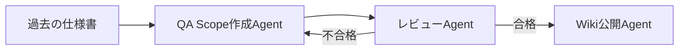
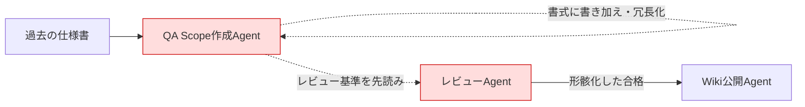
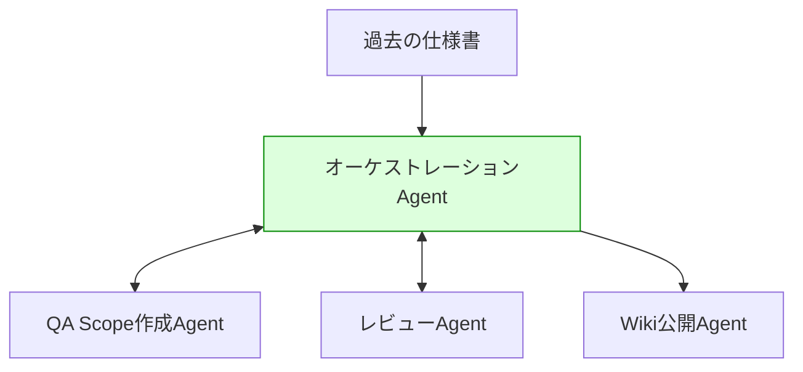

# 🤖 Claude Codeで作ったAgentがCodexで動かなかった話

## 🧭 はじめに

こんにちは！以前、コストパフォーマンスの観点から「Claude CodeからCodexへ移行してみた」という記録を書きました。あのときは承認フローの煩雑さや指示の「ゆらぎ」に振り回されつつも、最終的には「思考のClaude／実行のCodex」といういい感じの使い分けに落ち着いた……はずでした。

はずでした、というのは今回、実際に定型業務用のAgentワークフローをCodex上で本格稼働させてみたら、あの「ゆらぎ」がもっと具体的で、もっと厄介な形で襲いかかってきたからです😇

過去に作成した仕様書をもとに、以下のようなAgentワークフローをClaude Codeで構築していました。

1. 過去の仕様からQA Scopeを作成
2. 作成したQA Scopeをレビュー
3. レビューに合格するまで繰り返しレビュー
4. 合格したらWikiに公開

Claude Codeで動かしている間は、これが実に優等生に動いてくれていました。ところが、同じAgent構成をそのままCodex（GPT-5.5）環境に引っ越しさせたところ、想定していなかった挙動にぶち当たりました。今回はその珍道中の記録です。

もともとのワークフローは、次のようなシンプルな直列構成でした。

このレビューAgentは、実は行き当たりばったりで作ったものではありません。以前の記事（Quality Reviewerの内部構造）で書いた通り、当初は「なんとなく良さそうならOK」という曖昧な判断基準で差し戻し基準が揺れてしまう問題があり、そこから**5軸スコアリング（clarity／coverage／consistency／risk／structure）**を導入し、**1スキル＝1軸**でSKILL.mdを分割することで、揺れをほぼゼロまで抑え込んだ経緯があります。さらに別の記事（Pre-Review Model）では、成果物が完成してからレビューする「リアクティブ」な運用から、着手前の設計段階でレビューする「プロアクティブ」な運用へとシフトし、手戻りとトークン消費を大きく削減していました。

つまりClaude Code環境では、レビューAgentは自然言語による“なんとなくの判断”ではなく、**決定的なロジックとして固められたSkill**として動作しており、それが「揺れない基準点」として機能していました。……この鉄壁の基準点が、Codexに引っ越した途端に揺れ出すことになるとは、このときはまだ知る由もありませんでした。

## 💥 何が起きたか

Codex環境で動かしてみると、各Agentのステップ間で受け渡しているコンテキストを、Codexが良かれと思って（？）壊す・変えてしまう現象が発生しました。具体的には次の2点です。

### ✍️ 1. 決まった書式にCodexが書き加えて冗長化する

QA Scopeの仕様書にはルールとして書式が決まっていたのですが、Codexがそこに余計な記述を書き加えてしまい、出力が冗長になっていました。フォーマットを厳密に守ってほしい場面で、勝手に情報を補足してしまう挙動です。

### 🔮 2. レビュー基準を先読みしてしまい、レビューが形骸化する

さらに厄介だったのが、QA Scopeを作成する時点で、後工程にあるレビューAgentが何を基準にレビューするかをあろうことか先読みし、最初からレビューを通りやすいように仕様書を寄せて作ってしまう現象です。空気を読みすぎ、と言いたくなる仕上がりでした。

:::message alert
本来、QA Scope作成とレビューは独立した工程であるべきですが、これでは実質的に「自己採点」に近い状態になってしまい、レビューをループさせている意味がなくなってしまいます。🙅
:::

Codex環境では、この2つの現象によって工程間の境界が図のように滲んでしまっていました。

## 🔍 原因の切り分け

「これは一体何が起きているんだ……」と頭を抱えつつ調査を進める中、切り分けの手がかりになったのは、**同じ入力に対して生成される結果が毎回異なる**という点でした。

前述の通り、Claude Code時代のレビューAgentは5軸スコアリングという決定的なSkillとして実装されており、同じ入力なら同じスコア・同じ差し戻し判断が返ってくるはずのものでした。もしそのSkillの実装自体がCodex環境で壊れているなら、壊れ方も毎回同じになるはずです。しかし実際には出力が毎回ブレていたため、これは固定的な処理のバグではなく、**LLM自身の解釈によって生じている挙動**だと判断しました。

つまり、Agent間の受け渡しをプロンプトの流れ（LLMの解釈）に任せていたことが、後工程の意図を先読みしたり余計な情報を書き足したりする余地を生んでいた、というのが仮説です。この仮説に立つと、対処すべきはSkillの修正ではなく、**Agent間の受け渡し方そのもの**だということになります。

## 🗂️ 対応：Agentの棚卸し

そこで、初期のClaude Code実装のときのように、Agentの役割や指示を1から棚卸しし直しました。各Agentが「何を受け取り、何を出力すべきか」を改めて洗い出す作業です。棚卸しを進める中で見えてきたのは、Agent同士を直接会話させる構成そのものが、LLMに「相手の意図を汲み取る余地」を与えてしまっているという点でした。

## 💡 解決策：オーケストレーションAgentの導入

最終的な解決策として、個々のAgent（QA Scope作成／レビュー／Wiki公開）を直接連携させるのではなく、それらを束ねる**オーケストレーションAgent**を新設しました。Agent間の順序制御やコンテキストの受け渡しを、このオーケストレーションAgentに一任する構成に変更したことで、各Agentが受け取る情報を明示的・限定的にコントロールできるようになりました。

変更後の構成は次のようになります。各Agent同士が直接会話するのではなく、常にオーケストレーションAgentを介して情報がやり取りされます。

## 🌈 まとめ・学び

- Claude CodeとCodex（GPT-5.5）では、Agent間のコンテキスト受け渡しに対する解釈の挙動が異なる
- 出力の再現性（決定性）は、問題がSkill／ロジック起因かLLMの解釈起因かを切り分けるヒントになる
- Agent間のやり取りをLLMの解釈に委ねすぎると、後工程の意図を先読みしてしまい、レビューのような「独立性」が前提の工程が形骸化するリスクがある
- モデル自体の挙動を直接制御するのではなく、オーケストレーションAgent（制御構造）を挟むことで非決定性の影響範囲を局所化できる

ただし、これはあくまで「ハーネス（実行制御層）による封じ込め」であり、各Agentが単体で処理する範囲内での解釈のブレそのものを解消したわけではない、という点は留意しておく必要があります。今後、異なるモデル・環境間でAgentを移植する際は、Agent間の受け渡しをプロンプトの暗黙的な流れに任せず、明示的な制御構造を設計段階から組み込んでおくのが良さそうです。

「思考のClaude／実行のCodex」という使い分けを目指した前回から一歩進み、今回は「実行を束ねる制御構造」の必要性が見えてきた回でした。次にAgentを増やすときは、この構造を前提に設計していきたいと思います。

📝 **今日の振り返り:**
「空気を読みすぎるAI」というのも、なかなか新種の悩みだなと思いました。エージェントに人格はないはずなのに、こちらの意図を先読みされすぎると逆に信頼できなくなる、というのは人間関係みたいで面白い発見でした。オーケストレーションAgentという名の“仲介役”を置いたら平和になったので、結局は生きるも死ぬも「誰が誰と直接喋るか」問題なんだな、と実感した回でした🤝

## 🔗 関連記事

今回の話の前提になっている過去記事はこちらです。あわせてどうぞ！

- [Claude codeからCodexへ、移行の試行錯誤と「エージェントの作法」](https://zenn.dev/corone/articles/549eb4ba9adcec)
- [#42 Quality Reviewer の内部構造（実装編）](https://zenn.dev/corone/articles/0238083089322f)
- [#53 エラーが起きてからでは遅い！Pre-Review Modelによるプロアクティブな品質保証](https://zenn.dev/corone/articles/4c1acfb3e48a69)
